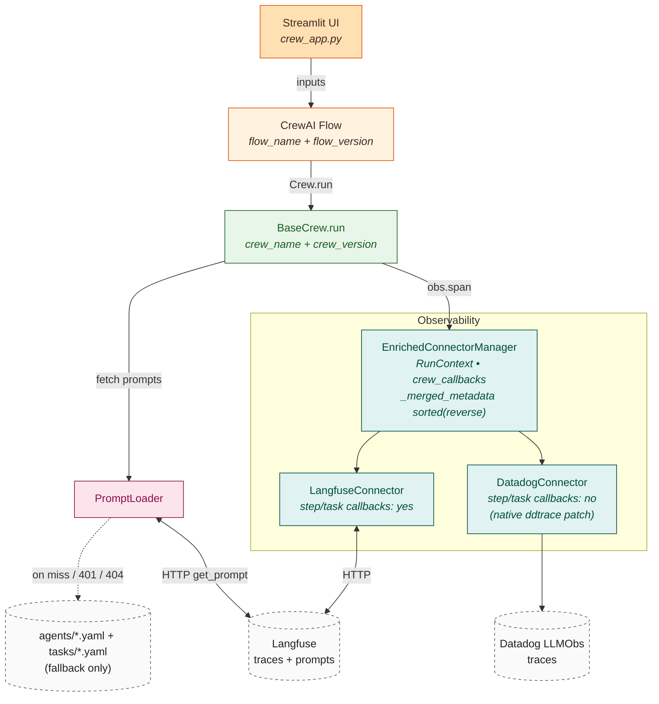
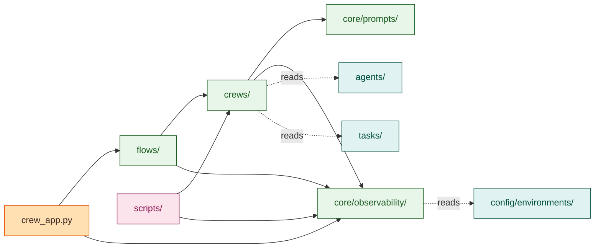
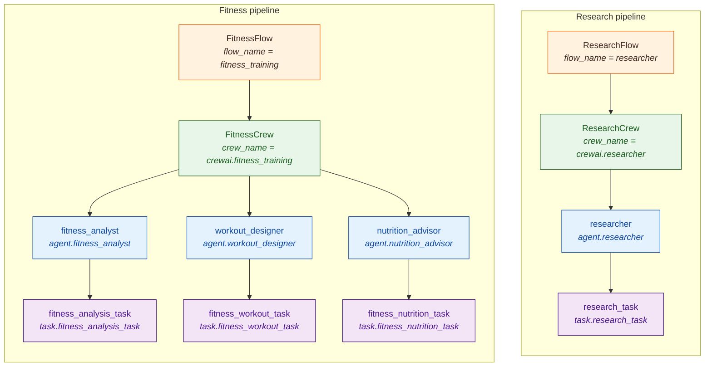
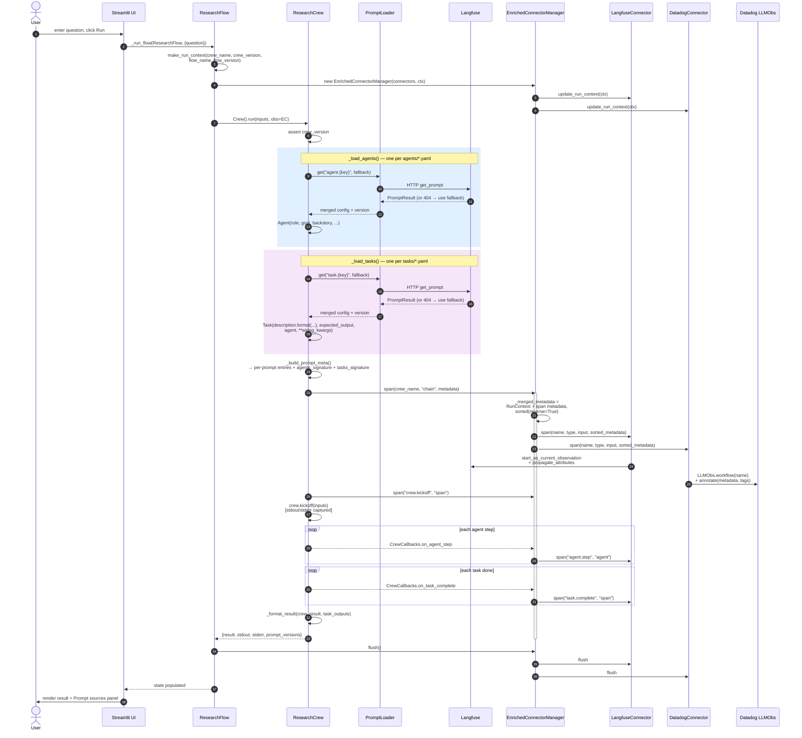

# System Overview — `langfuse-chat`

A multi-crew [CrewAI](https://docs.crewai.com) application with first-class
observability ([Langfuse](https://langfuse.com) + [Datadog LLM
Observability](https://docs.datadoghq.com/llm_observability/)), runtime-managed
prompts, and a Langfuse-driven experiment harness. The UI is Streamlit;
orchestration is CrewAI Flows; tracing fans out through a thin connector layer
so backends are plug-in.

- **Runtime:** Python 3.12 (`runtime.txt`)
- **App version:** see `VERSION`
- **Entry point:** `crew_app.py` (`py -3.12 -m streamlit run crew_app.py`)
- **Frameworks:** CrewAI, Streamlit, Langfuse, Pydantic, OpenAI SDK
  — pins live in `requirements.txt`.
- **Optional integrations:** Datadog LLM Observability (`ddtrace`)

---

## 1. Design Tenets

| Tenet | Realization in code |
|---|---|
| **Prompts evolve faster than code, so they live outside it.** | Every agent's `role`/`goal`/`backstory` and every task's `description`/`expected_output` resolves from Langfuse at runtime; the repo only carries a YAML *fallback* used when Langfuse is unreachable or the prompt is missing. |
| **Langfuse can edit LLM-text only — never wiring.** | `BaseCrew._pull_llm_text()` enforces a per-concept allowlist (`_AGENT_LLM_TEXT_FIELDS`, `_TASK_LLM_TEXT_FIELDS`). Any other key Langfuse returns is dropped. Model, tools, agent assignment, retries — none of these can drift via a Langfuse edit. |
| **Prompts of different concepts cannot collide.** | The Langfuse prompt name is `<namespace>.<bare-key>`. Namespaces are owned by the loader (`agent.`, `task.`); the bare key from YAML cannot contain a dot. `_namespaced()` rejects pre-prefixed keys to prevent double-namespacing. |
| **Identity is layered, not collapsed into one version.** | Four independent axes propagate on every trace: `app_version`/`deployment_sha` (deployment), `flow_version` (orchestration recipe), `crew_version` (crew recipe), `agents_signature`/`tasks_signature` (per-run prompt resolution). Each filterable on its own. |
| **Observability is a connector layer, not a backend.** | `BaseConnector` is the contract; `ConnectorManager` fans every operation out; `EnrichedConnectorManager` enriches with `RunContext`. New backends plug in by subclassing `BaseConnector`. |
| **Extensibility by convention, not framework lock-in.** | New crew = add YAMLs + a 4-line subclass. New observability backend = a single `BaseConnector` subclass. New CrewAI `Task(**kwargs)` field = YAML key only (passthrough). |

---

## 2. Architecture at a Glance



Reading the diagram:

- **Solid edges** are calls / data flow at runtime.
- **Dashed edge** to `agents/*.yaml + tasks/*.yaml` is the fallback path used only
  when Langfuse is unavailable or the prompt is missing.
- **Connectors** sit inside the Observability subgraph because they are owned
  by `EnrichedConnectorManager` (via the inner `ConnectorManager`).

---

## 3. Project Layout

High-level package dependencies (which package imports which; dashed edges are
file reads, not Python imports):



**Detailed file layout:**

```
langfuse-chat/
├── crew_app.py                  ← Streamlit entry point (tabs, flow wiring,
│                                  Datadog LLMObs init guarded at import time)
├── VERSION                      ← App semver — exposed as RunContext.app_version
├── runtime.txt                  ← `python-3.12` (deployment hint)
├── requirements.txt
├── SYSTEM_OVERVIEW.md           ← (this file)
├── SYSTEM_OVERVIEW.html         ← rendered via scripts/md_to_html.py
│
├── flows/                       ← Per-Flow entry points (Flow[State] subclasses)
│   ├── research_flow.py           single @start; ResearchState(question, result, …)
│   └── fitness_flow.py            single @start; FitnessState(goals, level, …)
│
├── crews/                       ← Template-method BaseCrew + concrete crews
│   ├── base.py                    BaseCrew, LLM-text allowlists, _namespaced helper
│   ├── common.py                  kickoff_crew (stdout/stderr capture, error mark)
│   ├── research_crew.py
│   └── fitness_crew.py
│
├── agents/                      ← Agent YAML — prompt_key + verbose/delegation flags
│   ├── researcher.yaml             + fallback block (role, goal, backstory)
│   ├── fitness_analyst.yaml
│   ├── workout_designer.yaml
│   └── nutrition_advisor.yaml
│
├── tasks/                       ← Task YAML — task_name, agent ref, prompt_key
│   ├── research_task.yaml          + fallback block (description, expected_output)
│   ├── fitness_analysis_task.yaml  + optional **wiring keys forwarded to Task()
│   ├── fitness_workout_task.yaml
│   └── fitness_nutrition_task.yaml
│
├── core/
│   ├── prompts/
│   │   └── loader.py            ← PromptLoader; Langfuse get_prompt + fallback merge
│   │
│   └── observability/
│       ├── base.py              ← BaseConnector ABC, SpanHandle ABC, ObsManager Proto
│       ├── __init__.py          ← ConnectorManager (fan-out + for_callbacks)
│       ├── span_limits.py       ← Truncation constants for span field sizes
│       ├── langfuse_connector.py
│       ├── datadog_connector.py
│       └── context/
│           ├── run_context.py   ← RunContext dataclass; as_metadata/as_tags/as_dd_tags
│           ├── session.py       ← make_run_context() factory
│           ├── enriched.py      ← EnrichedConnectorManager (RunContext propagation)
│           └── callbacks.py     ← CrewCallbacks (agent.step + task.complete spans)
│
├── config/
│   └── environments/            ← Per-env non-secrets (deployment_sha, model defaults)
│       ├── dev.yaml
│       ├── staging.yaml
│       └── prod.yaml
│
├── scripts/                     ← One-off CLIs (NOT part of the app runtime)
│   ├── bootstrap.py             ← sys.path / .env / logging setup for CLI scripts
│   ├── seed_prompts.py          ← Walk agents/+tasks/; create v1 production prompts
│   ├── run_experiment.py        ← Run ResearchFlow against a Langfuse dataset
│   └── md_to_html.py            ← Render SYSTEM_OVERVIEW.md → self-contained HTML
│
├── .agents/README.md            ← AI-coding-agent skill packs (gitignored content)
├── skills-lock.json             ← Tracked: pins skill packs by source + hash
└── .env                         ← Local secrets (gitignored — NEVER commit)
```

---

## 4. Core Concepts

### 4.1 Flow — the user-facing recipe

A Flow is a `crewai.flow.flow.Flow[State]` subclass with:

- A **Pydantic state model** (`ResearchState`, `FitnessState`) holding both
  inputs (`question`, `goals`, …) and outputs (`result`, `prompt_versions`,
  `stdout`, `stderr`).
- One or more **`@start()`** methods. Today both flows have exactly one.
- Two class attributes for trace identity:
  - `flow_name: ClassVar[str]` — short identifier (e.g. `"researcher"`).
  - `flow_version: ClassVar[str]` — semver. Bumped manually when the *flow*
    recipe changes (see 4.9).

The `@start` body is responsible for: building a `RunContext` via
`make_run_context(...)`, wrapping the connector manager in
`EnrichedConnectorManager(connectors, ctx)`, calling `Crew().run(inputs, obs)`,
flushing observability, and populating the state.

Flows give the UI a uniform `flow.kickoff(inputs={...})` interface independent
of which crew runs inside.

### 4.2 Crew — the inner LLM-driven recipe

`BaseCrew` (in `crews/base.py`) is a template-method ABC. Subclasses declare:

| Attribute / method | Required | Purpose |
|---|---|---|
| `crew_version: ClassVar[str]` | **yes** | Recipe semver; asserted non-empty at `run()` time. |
| `crew_name` (property) | yes | Root-span name (e.g. `"crewai.researcher"`). |
| `_agent_yaml_names` (property) | yes | Filenames in `agents/`. |
| `_task_yaml_names` (property) | yes | Filenames in `tasks/`, in execution order. |
| `_format_result(crew_result, task_outputs)` | optional | Custom output formatting (defaults to `str(crew_result)`). |

`run(inputs, obs)` is the one public entry point. The body is:

1. `assert self.crew_version` — fail fast if a subclass forgot.
2. `_load_agents()` — read each agent YAML, ask Langfuse for `agent.<prompt_key>`
   with the YAML `fallback` dict, pull only allowlisted LLM-text fields, build
   `Agent(**)`.
3. `_load_tasks(agents, inputs)` — read each task YAML, ask Langfuse for
   `task.<prompt_key>` with the YAML `fallback`, pull allowlisted LLM-text
   fields, then build `Task(description=…, expected_output=…, agent=…,
   **wiring_kwargs)`. `wiring_kwargs` is every YAML key *not* in
   `_TASK_RESERVED_KEYS` — meaning new CrewAI `Task` fields like `tools`,
   `async_execution`, `output_pydantic` are YAML-only to enable.
4. `Crew(agents, tasks, verbose=True, **get_crew_kwargs(obs))` — `get_crew_kwargs`
   adds `step_callback` and `task_callback` if `obs` exposes
   `crew_callbacks` (i.e. is an `EnrichedConnectorManager`), else `{}`.
5. `_build_prompt_meta(agent_prompts, task_prompts)` — produce a flat dict with
   per-prompt entries and two signature strings.
6. Open root span `obs.span(crew_name, "chain", input=inputs, metadata={
   "framework": "crewai", "crew": …, **prompt_meta})`.
7. `kickoff_crew(crew, obs, input_data=inputs)` — runs `crew.kickoff(inputs=…)`
   inside an inner `"crew.kickoff"` span, captures stdout/stderr, marks the
   span on error.
8. `_format_result(...)`, `root.set_output(...)`, return
   `{result, stdout, stderr, prompt_versions}`.

### 4.3 Agent — YAML scaffolding + Langfuse-managed text

**`agents/<name>.yaml` schema:**

```yaml
prompt_key: researcher        # bare key; loader prepends "agent."
verbose: true                 # forwarded to Agent(verbose=...)
allow_delegation: false       # forwarded to Agent(allow_delegation=...)
fallback:                     # used only when Langfuse is unreachable / missing
  role: Researcher
  goal: ...
  backstory: ...
```

**Langfuse-managed LLM-text fields:** `role`, `goal`, `backstory`,
`system_template`, `prompt_template`, `response_template`. Everything else the
Langfuse prompt config might return is silently dropped (`_pull_llm_text`).

### 4.4 Task — YAML wiring + Langfuse-managed text

**`tasks/<name>.yaml` schema:**

```yaml
task_name: research                 # short local name (used in span metadata keys)
agent: researcher                   # YAML stem of the agent in agents/
prompt_key: research_task           # bare key; loader prepends "task."
fallback:                           # used when Langfuse is unreachable / missing
  description: 'Research the question: "{question}"'
  expected_output: A clear, concise answer ...
# (any other key here is forwarded to Task(**), e.g. async_execution: true)
```

**Langfuse-managed LLM-text fields:** `description`, `expected_output`. After
fetch, both are run through Python `.format(**safe_inputs)` so `{var}`
placeholders bind to crew inputs. User-supplied input strings are
double-brace-escaped first so literal `{` / `}` in user text cannot collide
with format syntax.

**Reserved YAML keys** (consumed by the loader, not passed through):
`task_name`, `agent`, `prompt_key`, `fallback`. Everything else is
`**wiring_kwargs` to `Task(**)`.

### 4.5 PromptLoader — Langfuse with deterministic fallback

`core/prompts/loader.py`. Single method:

```python
loader = PromptLoader()
prompt = loader.get(name="agent.researcher", fallback={...},
                    label="production", cache_ttl=300)
# → PromptResult(config={merged}, version="<n>" or "fallback",
#                name=..., label=...)
```

| Scenario | Behavior |
|---|---|
| `LANGFUSE_*` env vars absent | Use fallback silently (expected in local dev). |
| Auth failure (401/403) | Log ERROR, use fallback. |
| Prompt not found (404) | Log WARNING, use fallback. |
| Langfuse unreachable | Log WARNING, use fallback. |
| Success | Return merged config + Langfuse version. |

The Langfuse SDK caches prompts in-process for `cache_ttl` seconds (default 300).
Production updates land within that TTL on already-running processes.

### 4.6 Observability — connector layer

**`BaseConnector`** (abstract):

```python
class BaseConnector(ABC):
    handles_step_callbacks: bool = True   # set False on backends with native CrewAI patching
    @property @abstractmethod def enabled(self) -> bool: ...
    @abstractmethod @contextmanager
    def span(self, name, span_type, input_data=None, metadata=None) -> Iterator[SpanHandle]: ...
    def flush(self) -> None: pass
    def update_run_context(self, context) -> None: pass
```

**`SpanHandle`** — yielded from `span()`. Callers may invoke `set_output(...)`
*and* `mark_error()` **at most once each** before the context manager exits.
Connectors do not merge multiple calls.

**`ConnectorManager`** — holds a list of enabled connectors. `span()` opens
each backend's span inside an `ExitStack` and yields a `MultiSpanHandle` that
fans `set_output` / `mark_error` calls out. `flush()` and `update_run_context()`
fan out similarly. `for_callbacks()` returns a filtered manager containing only
connectors with `handles_step_callbacks=True`.

**`EnrichedConnectorManager`** — wraps a `ConnectorManager` and adds:

- `RunContext` propagation: every `span()` call merges `ctx.as_metadata()` with
  the caller's metadata, then sorts the merged dict with `reverse=True` (see
  4.9) before passing to the inner manager.
- `crew_callbacks` (a `CrewCallbacks` instance) wired against a
  callbacks-filtered child manager, so only Langfuse-style connectors observe
  step/task sub-spans.
- `update_run_context(ctx)` is called on every connector at construction so
  trace-level fields (Langfuse session/user, Datadog session_id/tags) are set
  before the first span.

**Concrete connectors:**

| Connector | `handles_step_callbacks` | How RunContext flows in | Notes |
|---|---|---|---|
| `LangfuseConnector` | `True` | Span metadata kwarg (via `EnrichedConnectorManager`) + `propagate_attributes(session_id, user_id, tags)` inside each span | Uses `client.start_as_current_observation(name=…, as_type=…)`. |
| `DatadogConnector` | `False` | The connector itself merges `RunContext.as_metadata()` into each span's `LLMObs.annotate(metadata=…)` and adds `as_dd_tags()` | `ddtrace` already patches CrewAI natively; step/task callbacks are skipped to avoid double-instrumentation. |

### 4.7 Span types, truncation, and CrewAI callbacks

**Span type vocabulary** (passed as the second arg of `obs.span()`):

| Internal | Datadog mapping | Used by |
|---|---|---|
| `chain` | `workflow` | The crew root span. |
| `span` | `task` | `crew.kickoff`, `task.complete`. |
| `agent` | `agent` | `agent.step` (per CrewAI step callback). |
| `tool` | `tool` | Reserved — not currently emitted internally. |
| `generation` | `llm` | Reserved — emitted by ddtrace's native patching for Datadog. |

**Field truncation** (`core/observability/span_limits.py`):

| Field | Max chars |
|---|---|
| `THOUGHT` | 500 |
| `TOOL_INPUT` | 500 |
| `TASK_DESCRIPTION` | 500 |
| `AGENT_ROLE` | 100 |
| `STEP_OUTPUT` | 500 |
| `RESULT` | 2000 |

**Step / task callbacks** (`callbacks.py`):

- `_StepCallback` opens a span `agent.step` (`"agent"` type). For
  `AgentFinish`, it extracts thought + return value and detects the specific
  CrewAI "failed to parse LLM response" string as a parse-failure annotation.
  For `AgentAction`, it captures thought, tool, tool_input.
- `_TaskCallback` opens a span `task.complete` (`"span"` type) with truncated
  task description, agent role, and result.

Both run inside their own `try/except` so a callback error never breaks the
crew run.

### 4.8 RunContext — the run's identity card

Built once per crew run by `make_run_context(...)` and propagated to every span
by `EnrichedConnectorManager`. `core/observability/context/run_context.py`:

| Field | Source | Notes |
|---|---|---|
| `session_id` | Streamlit tab (`st.session_state.obs_session_id`) | One per browser tab. Falls back to `SESSION_ID` env then `uuid4()` outside Streamlit. |
| `run_id` | `uuid4()` per crew run | Also the default for `workflow_id`. |
| `user_id` | `USER_ID` env var, falls back to `session_id` | |
| `environment` | `ENVIRONMENT` env (default `dev`) | Selects `config/environments/<env>.yaml`. |
| `app_version` | `VERSION` file (fallback: `APP_VERSION` env, then `0.0.0`) | |
| `crew_name` | Caller-provided | e.g. `"researcher"`, `"fitness_training"`. |
| `flow_name` | From `Flow.flow_name` class attr | Same as `crew_name` today (1:1); will diverge if a Flow grows to orchestrate multiple Crews. |
| `crew_version` | `Crew.crew_version` class attr (passed by Flow) | Recipe semver. |
| `flow_version` | `Flow.flow_version` class attr | Flow recipe semver. |
| `deployment_sha` | `config/environments/<env>.yaml` or `DEPLOYMENT_SHA` env | |
| `model_version` | `config/environments/<env>.yaml` `model_defaults.default` or `MODEL_VERSION` env | |
| `workflow_id` | Settable property; defaults to `run_id` | For grouping retries of the same logical workflow. |

Three projections used by connectors:

- `as_metadata()` — flat dict for trace/span metadata (drops empty values).
- `as_tags()` — list of `key:value` strings for Langfuse trace tags (e.g.
  `env:dev`, `crew:researcher`, `flow:researcher`, `version:<app-semver>`,
  `sha:<8-char-prefix>`).
- `as_dd_tags()` — flat dict for Datadog tag annotation (with the SHA
  truncated to 8 chars).

### 4.9 Four-layer versioning model

The trace carries four independent identity axes. Each is filterable in
Langfuse without affecting the others.

| Layer | Field(s) | When it changes | Owner |
|---|---|---|---|
| **Deployment** | `app_version` (`VERSION` file) + `deployment_sha` (env config) | Every deploy | Build/release |
| **Flow recipe** | `flow_version` (`ClassVar` on the Flow class) | Manual PR bump when `@start`/`@listen`/`@router` topology, state-model fields, orchestrated crew(s), or post-processing semantics change | Flow authors |
| **Crew recipe** | `crew_version` (`ClassVar` on the Crew class) | Manual PR bump when `_agent_yaml_names`, `_task_yaml_names`, `_format_result`, the wired tool set, or a prompt key changes | Crew authors |
| **Per-run prompt resolution** | `agents_signature`, `tasks_signature` (root-span metadata) + per-prompt `prompt_version` entries | Auto — whenever Langfuse serves a different version for any agent/task prompt | Runtime + Langfuse |

The non-overlap matters:

- A **Langfuse prompt edit** moves the `*_signature`; `crew_version`/`flow_version`
  do not bump.
- A **crew YAML / code change** (swap an agent, reorder tasks) bumps
  `crew_version`; `flow_version` does not bump.
- A **flow body change** (add a `@listen`, change state shape) bumps
  `flow_version`; `crew_version` does not bump.
- A **deploy** moves `deployment_sha` regardless of any recipe change.

The bump rules are codified as comments next to each `flow_version` and
`crew_version` declaration in code.

### 4.10 Trace metadata key order

Langfuse renders dict keys in reverse-insertion order. To present a stable
forward-alphabetical view in the UI, `EnrichedConnectorManager._merged_metadata`
sorts the final dict with `reverse=True` before handing it to the inner
connector. This is the single source of truth for trace key ordering — the
producer-side dicts (`RunContext.as_metadata()`, `BaseCrew._build_prompt_meta()`)
are intentionally insertion-ordered.

This couples our code to a Langfuse rendering quirk. If Langfuse ever switches
to insertion-order display, flip the `reverse` flag (one line, in
`enriched.py`). The coupling is documented in-place.

---

## 5. Component Inventory

What's defined in the repo today. Update this section whenever you add a
flow / crew / agent / task — every other section in this doc is structural
and stable; this one is the concrete snapshot.

### 5.1 Topology



Notes on the diagram:

- Solid edges are *contains / drives*: a Flow contains a Crew; a Crew contains
  agents; an agent owns its task.
- The Langfuse prompt name (`agent.<key>`, `task.<key>`) is shown italic under
  each agent/task — that's the name to look for in Langfuse → Prompts.
- `FitnessCrew._format_result` joins three markdown sections in the order
  shown: *## Fitness Profile Analysis*, *## Workout Program*, *## Nutrition Plan*.
- Concrete `crew_version` / `flow_version` values are intentionally not in the
  diagram (they drift). Read them off `Crew.crew_version` / `Flow.flow_version`
  in code, or filter on them in Langfuse trace metadata.

### 5.2 Flows

| Flow | Module | State model | Crew | `@start` method |
|---|---|---|---|---|
| `ResearchFlow` | `flows/research_flow.py` | `ResearchState` | `ResearchCrew` | `run_research()` |
| `FitnessFlow` | `flows/fitness_flow.py` | `FitnessState` | `FitnessCrew` | `run_fitness_plan()` |

### 5.3 Crews

| Crew | `crew_name` | Agents (in order) | Tasks (in execution order) | `_format_result` |
|---|---|---|---|---|
| `ResearchCrew` | `crewai.researcher` | `researcher` | `research` | default — `str(crew_result)` |
| `FitnessCrew` | `crewai.fitness_training` | `fitness_analyst`, `workout_designer`, `nutrition_advisor` | `analysis`, `workout`, `nutrition` | custom — joins 3 markdown sections |

### 5.4 Agents

| YAML | `prompt_key` (→ Langfuse `agent.<key>`) | Fallback role | Used by |
|---|---|---|---|
| `agents/researcher.yaml` | `researcher` | Researcher | `ResearchCrew` |
| `agents/fitness_analyst.yaml` | `fitness_analyst` | Fitness Analyst | `FitnessCrew` |
| `agents/workout_designer.yaml` | `workout_designer` | Workout Program Designer | `FitnessCrew` |
| `agents/nutrition_advisor.yaml` | `nutrition_advisor` | Nutrition Advisor | `FitnessCrew` |

### 5.5 Tasks

| YAML | `task_name` | `prompt_key` (→ Langfuse `task.<key>`) | Owning agent | Used by |
|---|---|---|---|---|
| `tasks/research_task.yaml` | `research` | `research_task` | `researcher` | `ResearchCrew` |
| `tasks/fitness_analysis_task.yaml` | `analysis` | `fitness_analysis_task` | `fitness_analyst` | `FitnessCrew` |
| `tasks/fitness_workout_task.yaml` | `workout` | `fitness_workout_task` | `workout_designer` | `FitnessCrew` |
| `tasks/fitness_nutrition_task.yaml` | `nutrition` | `fitness_nutrition_task` | `nutrition_advisor` | `FitnessCrew` |

### 5.6 Langfuse prompts (after `scripts/seed_prompts.py`)

Running the seeder creates 8 prompts at the `production` label — one per
agent/task YAML file:

```
agent.researcher              task.research_task
agent.fitness_analyst         task.fitness_analysis_task
agent.workout_designer        task.fitness_workout_task
agent.nutrition_advisor       task.fitness_nutrition_task
```

The seeder is name-idempotent: re-running creates a *new version* on each
existing prompt (the `production` label floats to the newest). Use it to
re-publish the YAML fallback as a fresh Langfuse version.

---

## 6. Runtime Sequence (one Research run)



Things worth noting in the sequence:

- The two **shaded blocks** are the only places that talk to Langfuse for
  prompts. Both fall back to YAML on miss/auth/404 without re-raising.
- **`_merged_metadata`** is the single point that sorts trace metadata —
  every downstream connector receives the same dict in the same order.
- **Step/task callbacks** fire only on connectors with
  `handles_step_callbacks=True` (Langfuse). Datadog's CrewAI integration
  is patched natively by `ddtrace`, so we skip our own callbacks for it.
- **Flush** is called by the Flow after the crew returns; it drains any
  pending batches in each connector before the function exits.

---

## 7. Configuration

### Environment variables

#### Required

| Var | Purpose |
|---|---|
| `LANGFUSE_PUBLIC_KEY` | Langfuse SDK auth. |
| `LANGFUSE_SECRET_KEY` | Langfuse SDK auth. |
| `OPENAI_API_KEY` | Used by CrewAI agents (via OpenAI SDK). |

#### Optional — runtime

| Var | Default | Purpose |
|---|---|---|
| `LANGFUSE_BASE_URL` | `https://cloud.langfuse.com` | Self-hosted Langfuse. |
| `ENVIRONMENT` | `dev` | Selects `config/environments/<env>.yaml`. |
| `LOG_LEVEL` | `INFO` | Python logging level. |
| `USER_ID` | session id | Override per-run user identity. |
| `APP_VERSION` | `VERSION` file or `0.0.0` | Override app semver. |
| `MODEL_VERSION` | env config | Override the recorded model id. |
| `DEPLOYMENT_SHA` | env config | Override the recorded build SHA. |
| `SESSION_ID` | `uuid4()` | Override when not running under Streamlit. |
| `SEED_LABEL` | `production` | Label used by `scripts/seed_prompts.py`. |

#### Optional — Datadog LLM Observability

| Var | Default | Purpose |
|---|---|---|
| `DD_LLMOBS_ENABLED` | unset (disabled) | `1`/`true` to enable. Read at import time. |
| `DD_TRACE_LLMOBS_IN_CODE` | `1` | Skip in-code init (rely on `ddtrace-run`). |
| `DD_API_KEY` | — | Required when enabled. |
| `DD_SITE` | `datadoghq.com` | Datadog regional site. |
| `DD_LLMOBS_ML_APP` | `crew-streamlit` | ML App identifier. |
| `DD_LLMOBS_AGENTLESS_ENABLED` | `true` | Bypass local Datadog Agent. |
| `DD_LLMOBS_INTEGRATIONS_ENABLED` | `true` | Auto-instrument OpenAI etc. |
| `DD_ENV`, `DD_SERVICE` | — | Datadog resource tags. |
| `DD_LLMOBS_SESSION_ID` | — | Hard override for span session_id when RunContext doesn't carry one. |

### Environment files

`config/environments/<env>.yaml`:

```yaml
# config/environments/dev.yaml
environment: dev
deployment_sha: "local"
model_defaults:
  default: gpt-4o-mini
```

Selected by `ENVIRONMENT`. Cached in-process after first read.

### Local secrets

`.env` at the repo root is loaded by `crew_app.py` at import time (via
`python-dotenv`). It is gitignored and must remain so.

---

## 8. Extension Points

### Add a new crew

1. **Agent YAML** — `agents/<agent>.yaml` with `prompt_key`, optional `verbose`/`allow_delegation`, and a `fallback` dict (`role`, `goal`, `backstory`).
2. **Task YAML** — `tasks/<task>.yaml` with `task_name`, `agent` (the YAML stem of the agent), `prompt_key`, and a `fallback` dict (`description`, `expected_output`).
3. **Crew class** — `crews/<n>_crew.py`:
   ```python
   from typing import List
   from .base import BaseCrew

   class MyCrew(BaseCrew):
       crew_version = "1.0.0"
       @property
       def crew_name(self): return "crewai.my_crew"
       @property
       def _agent_yaml_names(self): return ["my_agent.yaml"]
       @property
       def _task_yaml_names(self): return ["my_task.yaml"]
   ```
4. **Flow class** — `flows/<n>_flow.py` mirroring `ResearchFlow`. Set
   `flow_name` and `flow_version` as `ClassVar` strings.
5. **Langfuse prompts** — `scripts/seed_prompts.py` will pick up the new
   YAMLs automatically. Run it once to create `agent.<prompt_key>` and
   `task.<prompt_key>` at v1 production.
6. **UI tab** — add a tab in `crew_app.py` that calls `_run_flow(MyFlow, {...})`.

### Add a new observability backend

1. Subclass `BaseConnector` in `core/observability/<name>_connector.py`.
2. Implement `enabled`, `@contextmanager span()`, optionally `flush()` and
   `update_run_context()`. Yield a `SpanHandle` subclass from `span()`.
3. If the backend has native CrewAI instrumentation, set
   `handles_step_callbacks = False` so our step/task callbacks don't
   double-instrument.
4. Wire an instance into `_get_connectors()` in `crew_app.py`.

### Edit a prompt without a deploy

Open Langfuse → Prompts → `agent.<key>` or `task.<key>` → edit → promote to
the `production` label. Active processes pick up the new version within the
SDK cache TTL (default 300 s, configurable per call). The change shows up in
the trace's `*_signature` and per-prompt `prompt_version` metadata. No code
deploy, no recipe-version bump.

### Add a CrewAI Task field

If CrewAI ships a new `Task(**)` kwarg (e.g. `human_input`, `markdown`,
`async_execution`), just add the key to the task YAML next to `agent:` /
`prompt_key:`. The loader forwards anything outside `_TASK_RESERVED_KEYS`
verbatim into `Task(**)`. Note: `context` (Task→Task dependency) and
`output_pydantic` (`"module:Class"` style) need a resolver pass before raw
passthrough is safe — add when needed.

---

## 9. User Instructions

### 9.1 First-time setup

```bash
git clone <repo-url> langfuse-chat
cd langfuse-chat

py -3.12 -m venv .venv
.venv\Scripts\activate            # Windows
# source .venv/bin/activate       # macOS / Linux

pip install -r requirements.txt
```

Create `.env` at the repo root:

```env
LANGFUSE_PUBLIC_KEY=pk-lf-...
LANGFUSE_SECRET_KEY=sk-lf-...
LANGFUSE_BASE_URL=https://cloud.langfuse.com
OPENAI_API_KEY=sk-...
ENVIRONMENT=dev

# Datadog LLMObs (optional)
# DD_LLMOBS_ENABLED=1
# DD_API_KEY=...
# DD_SITE=datadoghq.com
# DD_LLMOBS_ML_APP=crew-streamlit
```

Seed Langfuse with v1 prompts for every agent and task:

```bash
py -3.12 scripts/seed_prompts.py
```

Expected output: one `[OK]` line per agent/task YAML. Re-running creates
new versions on existing prompts (idempotent w.r.t. names; not w.r.t.
versions) — the `production` label floats to the newest.

### 9.2 Run the app

```bash
py -3.12 -m streamlit run crew_app.py
```

The app opens at `http://localhost:8501` with three tabs:

- **Research** — single-agent flow. Enter a question, click **Run research**.
- **Fitness Training** — three-agent pipeline (analyst → workout designer →
  nutrition advisor). Fill the form, click **Generate fitness plan**.
- **Experiments** — runs `ResearchFlow` against a Langfuse dataset and logs
  each item as a Langfuse experiment.

Each result panel shows:

- The model output (markdown rendered for fitness).
- **Prompt sources** — per-agent prompt name + version, color-coded by source
  (green for Langfuse, yellow for YAML fallback).
- **stdout / stderr** — expandable capture from CrewAI internals.

> **Streamlit hot-reload caveat:** editing files under `core/`, `crews/`,
> or `flows/` requires a full Streamlit restart (Ctrl-C, re-run). Streamlit
> hot-reloads the *script body* but not already-imported modules.

### 9.3 Run an experiment

In the **Experiments** tab:

1. Enter the Langfuse dataset name (must already exist in your project).
2. Enter an experiment-name prefix (a timestamp suffix is appended).
3. Click **Run experiment**.

Results land in **Langfuse → Datasets → `<dataset>` → Experiments**.

Headless alternative:

```bash
py -3.12 scripts/run_experiment.py
```

### 9.4 Read traces in Langfuse

Filter keys to know:

| Field | Where | What it tells you |
|---|---|---|
| `crew_name` | Trace metadata + tag | Which crew (`researcher`, `fitness_training`). |
| `flow_name` | Trace metadata + tag | Which flow (`researcher`, `fitness_training`). Today equal to `crew_name`; diverges for multi-crew flows. |
| `crew_version` | Trace metadata | Which **recipe** version (semver). |
| `flow_version` | Trace metadata | Which **flow recipe** version (semver). |
| `agents_signature` | Root-span metadata | Which agent prompt versions resolved (e.g. `"researcher@2"`). |
| `tasks_signature` | Root-span metadata | Which task prompt versions resolved (e.g. `"research@1"`). |
| `agent.<n>.prompt_version` | Root-span metadata | Per-agent drill-down. |
| `task.<n>.prompt_version` | Root-span metadata | Per-task drill-down. |
| `app_version` | Trace metadata + tag | Which app build. |
| `deployment_sha` | Trace metadata + tag | Which commit. |
| `session_id` / `user_id` | Trace attribute | Group by browser tab / user. |

Useful combinations:

- Fix `crew_version` → group all runs of the same recipe.
- Fix `crew_version`, vary `tasks_signature` → A/B compare task prompt versions.
- Fix `flow_version`, vary `crew_version` → see crew-recipe evolution under a stable flow.

### 9.5 Troubleshooting

| Symptom | Likely cause | Fix |
|---|---|---|
| App fails at start with `Missing required environment variable` | `.env` not loaded or var missing. | Check `.env` exists at the repo root and required vars are set. |
| **Prompt sources** panel shows yellow "YAML fallback" warnings | Prompt missing at `production` label, or Langfuse unreachable. | Promote the prompt in the Langfuse UI; verify `LANGFUSE_*` env vars. Logs at WARNING level identify which. |
| `assert self.crew_version` fails | Crew subclass missed `crew_version = "..."` declaration. | Add it. |
| Datadog traces missing despite `DD_LLMOBS_ENABLED=1` | `ddtrace` not installed or `DD_API_KEY` missing. | `pip install -r requirements.txt`; verify Datadog env vars. The boolean `_DD_LLMOBS_ACTIVE` in `crew_app.py` reflects whether init succeeded. |
| Streamlit cache-miss errors inside CrewAI's `ThreadPoolExecutor` | A cached resource was first resolved in a background thread. | `_run_flow` already pre-resolves `_get_langfuse()` and `_get_connectors()` in the main thread; do not move that resolution. |
| Edits to `core/`, `crews/`, or `flows/` don't take effect | Streamlit hot-reload doesn't refresh already-imported modules. | Ctrl-C and re-run `streamlit run crew_app.py`. |
| `_namespaced ... must be bare (no dots)` ValueError | A YAML `prompt_key` contains a `.`. | Use bare keys; the loader prefixes `agent.` / `task.` automatically. |
| `npx skills add ...` reinstalls flat under `.agents/skills/<name>/` | The `skills` CLI doesn't know about per-vendor subfolders. | Move into `.agents/skills/<vendor>/` and re-point the Junction at `.claude/skills/<name>`. See `.agents/README.md`. |
| Seeder crashes with `UnicodeEncodeError` on Windows | (Should be fixed.) Earlier versions used Unicode glyphs in `print()`. | Pull the latest; the seeder now emits ASCII `[OK]` / `[FAIL]`. |

### 9.6 Day-to-day workflow

- **Edit a prompt** → Langfuse UI → save → promote to `production`. No deploy. Cache TTL applies.
- **Add an agent to a crew** → new agent YAML + edit `_agent_yaml_names` + bump that crew's `crew_version`. Re-seed.
- **Add a task field (e.g. `tools`)** → edit the task YAML, add the key alongside `agent:`. No code change. Bump `crew_version` because wiring changed.
- **Change flow state shape** → edit the Pydantic state model, bump `flow_version`. `crew_version` does *not* change unless the crew also changed.
- **Add a new crew** → see §8.

---

## 10. Related Documents & Pointers

- `.agents/README.md` — AI-coding-agent skill packs (CrewAI + Langfuse), layout convention, and how teammates restore via `npx skills experimental_install`.
- `core/prompts/loader.py` module docstring — Langfuse prompt setup details.
- `crew_app.py` module docstring — quick-reference for required env + the run command.
- `crews/base.py` — `BaseCrew.crew_version` comment, `_AGENT_LLM_TEXT_FIELDS` / `_TASK_LLM_TEXT_FIELDS` / `_TASK_RESERVED_KEYS` constants, and the `_namespaced` invariant.
- `flows/<name>_flow.py` — `flow_version` bump rules, codified inline above each declaration.
- `core/observability/context/enriched.py` — the comment in `_merged_metadata` explaining the Langfuse reverse-display coupling.
